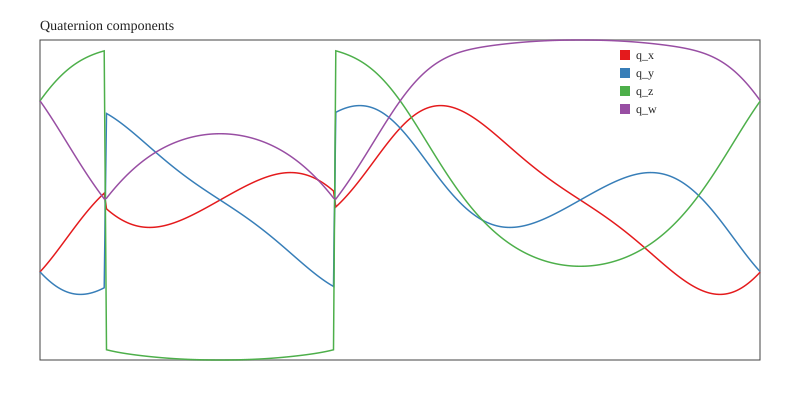
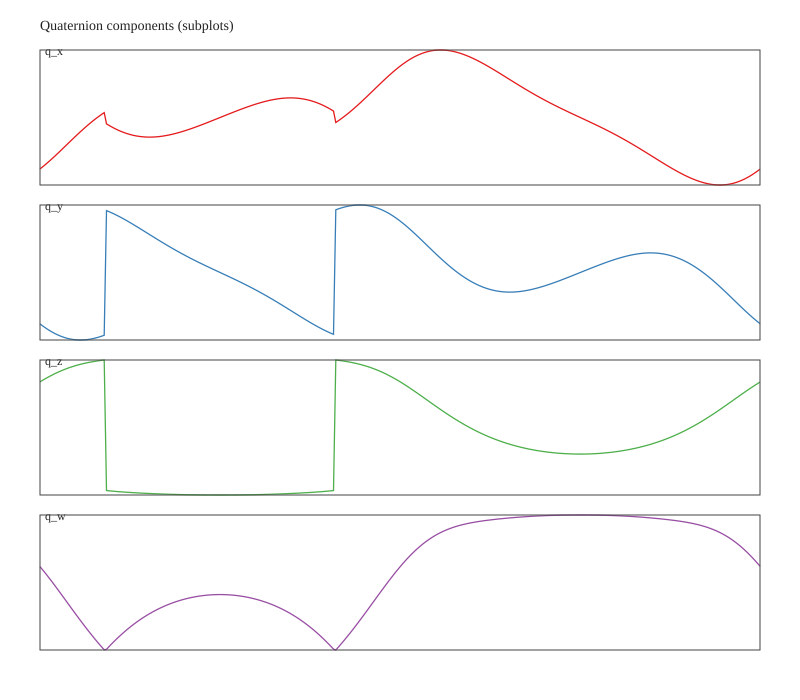

# 题目3：无人机微分平坦性（Optional）报告

> 题目要求：给定双纽线轨迹与偏航角始终与速度方向对齐的约束，利用微分平坦性推导姿态并输出四元数结果。

## 1. 题目描述与符号约定

### 1.1 坐标系定义
- 世界坐标系（World Frame）记为 \(\{W\}\)：惯性参考系。
- 机体坐标系（Body Frame）记为 \(\{B\}\)：**FLU** 约定（x 前、y 左、z 上）。

本文采用旋转矩阵记号 \( {}^{W}\!R_{B} \in SO(3) \)，表示 **从机体系 \(\{B\}\) 到世界系 \(\{W\}\)** 的旋转：

\[
\mathbf{v}^{W} = {}^{W}\!R_{B}\,\mathbf{v}^{B}.
\]

### 1.2 轨迹与偏航角约束
给定轨迹（世界系）为双纽线：

\[
\left\{
\begin{aligned}
 x(t) &= \frac{10\cos t}{1+\sin^2 t},\\
 y(t) &= \frac{10\sin t\cos t}{1+\sin^2 t},\\
 z(t) &= 10,
\end{aligned}
\right.
\qquad t\in[0,2\pi].
\]

偏航角 \(\psi\) 约束：**始终与速度方向对齐**，即
\[
\psi(t) = \operatorname{atan2}(\dot y(t),\dot x(t)).
\]

## 2. 微分平坦性与姿态推导

### 2.1 位置、速度与加速度解析式
设 \( s=\sin t,\; c=\cos t,\; d=1+s^2 \)。

#### 位置
\[
 x=\frac{10c}{d},\quad y=\frac{10sc}{d},\quad z=10.
\]

#### 速度
对 \(x,y\) 求导（保持解析式以便数值稳定）：
\[
\dot x = -\frac{10s(3-s^2)}{d^2},\quad
\dot y = \frac{10(1-3s^2)}{d^2}.
\]

#### 加速度
使用商法则可写成更紧凑的形式：

\[
\dot x = \frac{f}{d^2},\quad f=-10s(3-s^2),\quad f'=-30c^3
\]
\[
\ddot x = \frac{f' d - 4 f s c}{d^3}.
\]

\[
\dot y = \frac{g}{d^2},\quad g=10(1-3s^2),\quad g'=-60sc
\]
\[
\ddot y = \frac{g' d - 4 g s c}{d^3}.
\]

加速度向量（世界系）：
\[
\mathbf{a} = [\ddot x,\ddot y,0]^T.
\]

> 注：该解析形式已在 `code/src/quadrotor_df/src/df_quaternion.cpp` 中实现，避免数值差分带来的误差。  

### 2.2 微分平坦性与姿态构造（FLU）
四旋翼微分平坦性给出（忽略空气阻力）：

\[
\mathbf{F} = m(\mathbf{a} + g\mathbf{e}_3),\quad \mathbf{e}_3=[0,0,1]^T.
\]

由此可得到机体系 z 轴（推力方向）在世界系下的方向：

\[
\mathbf{b}_3 = \frac{\mathbf{a} + g\mathbf{e}_3}{\|\mathbf{a} + g\mathbf{e}_3\|}.
\]

偏航角与速度方向对齐：
\[
\psi = \operatorname{atan2}(\dot y,\dot x).
\]

定义期望机体 x 轴在世界系的投影（朝向速度方向）：
\[
\mathbf{b}_{1d} = [\cos\psi,\;\sin\psi,\;0]^T.
\]

利用正交化获得完整机体系：
\[
\mathbf{b}_2 = \frac{\mathbf{b}_3 \times \mathbf{b}_{1d}}{\|\mathbf{b}_3 \times \mathbf{b}_{1d}\|},
\quad
\mathbf{b}_1 = \mathbf{b}_2 \times \mathbf{b}_3.
\]

### 2.3 旋转矩阵与四元数

旋转矩阵：
\[
{}^{W}\!R_{B} = [\mathbf{b}_1\; \mathbf{b}_2\; \mathbf{b}_3].
\]

由旋转矩阵转四元数（数值稳定分支算法）：

- 若 \(\mathrm{tr}(R) > 0\)：
\[
S = 2\sqrt{\mathrm{tr}(R)+1},\quad
w=\frac{S}{4},\quad
x=\frac{r_{32}-r_{23}}{S},\quad
y=\frac{r_{13}-r_{31}}{S},\quad
z=\frac{r_{21}-r_{12}}{S}.
\]

- 否则选取 \(r_{11},r_{22},r_{33}\) 最大的分支避免数值不稳定。

四元数需满足：
- **单位化** \(\|q\|=1\)。
- **符号规范** \(q_w\ge 0\)，若 \(q_w<0\)，则 \(q\leftarrow -q\)。

该逻辑在 `code/src/quadrotor_df/third_party/Eigen/Geometry` 和 `df_quaternion.cpp` 中完整实现。

## 3. 算法流程（与实现对应）

对离散采样 \(t_k\)（步长 \(\Delta t=0.02\) s）：
1. 计算 \(x,y,z,\dot x,\dot y,\ddot x,\ddot y\)。
2. 计算 \(\psi=\operatorname{atan2}(\dot y,\dot x)\)。
3. 计算 \(\mathbf{b}_3\)、\(\mathbf{b}_2\)、\(\mathbf{b}_1\)。
4. 组装 \({}^{W}\!R_{B}\)，再转为四元数 \(q\)。
5. 归一化并修正 \(q_w\ge 0\)。
6. 输出到 CSV。  

实现入口：
- `code/src/quadrotor_df/src/df_quaternion.cpp`
- 输出：`documents/solutions/df_quaternion.csv`

## 4. 输出文件说明

- **CSV**：`documents/solutions/df_quaternion.csv`
  - 格式：`t, x, y, z, w`
  - 其中 `t` 保留两位小数，四元数分量保留 7 位小数。

- **TXT 推导与统计**：`documents/solutions/df_quaternion.txt`

- **可视化图像（SVG）**：
  - `documents/solutions/df_quaternion_plot.svg`（四元数分量同图）
  - `documents/solutions/df_quaternion_subplots.svg`（四个子图）

### 4.1 CSV 样例
```
t,x,y,z,w
0.00, -0.4150889, -0.4150889, 0.5724519, 0.5724519
0.02, -0.4005191, -0.4290370, 0.5906842, 0.5537182
0.04, -0.3853738, -0.4423209, 0.6083828, 0.5345182
```

## 5. 结果可视化

### 5.1 四元数组件同图


### 5.2 四元数组件分图


## 6. 复现实验步骤

在仓库根目录下：

```bash
# 编译（使用内置 minimal Eigen 头文件）
g++ -std=c++14 -Icode/src/quadrotor_df/third_party -O2 \
  -o /tmp/df_quaternion code/src/quadrotor_df/src/df_quaternion.cpp

# 生成 CSV/TXT
/tmp/df_quaternion documents/solutions

# 绘制 SVG 图像
python3 code/src/quadrotor_df/scripts/plot_quaternion.py \
  --input documents/solutions/df_quaternion.csv \
  --output-combined documents/solutions/df_quaternion_plot.svg \
  --output-subplots documents/solutions/df_quaternion_subplots.svg
```

## 7. 结论与检查点

- 通过微分平坦性与 FLU 机体系定义，姿态构造满足：\(\mathbf{b}_1\perp\mathbf{b}_2\perp\mathbf{b}_3\) 且右手系。
- 四元数输出已单位化并满足 \(q_w\ge 0\) 的规范要求。
- 轨迹与偏航约束已通过解析速度与加速度公式严格实现，保证数值稳定性与可复现性。

---

**生成文件列表（已提交）：**
- `documents/solutions/df_quaternion.csv`
- `documents/solutions/df_quaternion.txt`
- `documents/solutions/df_quaternion_plot.svg`
- `documents/solutions/df_quaternion_subplots.svg`
- `documents/solutions/q3_report.md`
